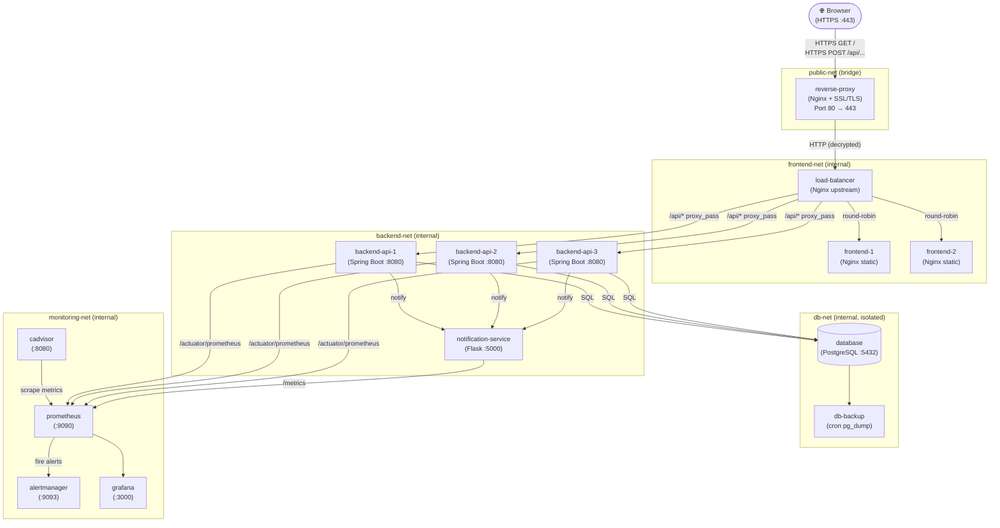

# TaskFlow – Systemarchitektur

> **Projekttyp:** Universitätsprojekt – Multi-Service Docker-Compose-Infrastruktur  
> **Letzte Aktualisierung:** Mai 2026

---

## Inhaltsverzeichnis

1. [Überblick](#1-überblick)
2. [Architekturdiagramm](#2-architekturdiagramm)
3. [Dienste und Aufgaben](#3-dienste-und-aufgaben)
4. [Netzwerke und Isolation](#4-netzwerke-und-isolation)
5. [Warum Reverse-Proxy UND Load-Balancer?](#5-warum-reverse-proxy-und-load-balancer)
6. [Datenflüsse](#6-datenflüsse)
7. [Datenbank-Sicherheitsisolation](#7-datenbank-sicherheitsisolation)

---

## 1. Überblick

TaskFlow ist eine containerisierte Web-Applikation bestehend aus:

| Ebene | Dienste |
|---|---|
| **Eingang / TLS** | `reverse-proxy` (Nginx + SSL) |
| **Lastverteilung** | `load-balancer` (Nginx upstream) |
| **Frontend** | `frontend-1`, `frontend-2` (statische Nginx-Container) |
| **Backend** | `backend-api-1`, `backend-api-2`, `backend-api-3` (Spring Boot) |
| **Benachrichtigung** | `notification-service` (Python Flask) |
| **Datenbank** | `database` (PostgreSQL) |
| **Datensicherung** | `db-backup` |
| **Monitoring** | `cadvisor`, `prometheus`, `alertmanager`, `grafana` |

---

## 2. Architekturdiagramm



> [!NOTE]
> Das Diagramm zeigt nur die wichtigsten Verbindungen. Monitoring-Scraping erfolgt intern über `monitoring-net` und ist vom Traffic-Pfad der Endnutzer vollständig getrennt.

---

## 3. Dienste und Aufgaben

| Dienst | Image / Technologie | Aufgabe |
|---|---|---|
| `reverse-proxy` | Nginx | TLS-Terminierung, HTTP→HTTPS-Weiterleitung, WAF (Phase 2: ModSecurity) |
| `load-balancer` | Nginx | Round-Robin-Verteilung auf Frontends und Backend-APIs |
| `frontend-1` | Nginx (statisch) | Ausliefern der Vue/React SPA |
| `frontend-2` | Nginx (statisch) | Redundante Kopie von `frontend-1` |
| `backend-api-1/2/3` | Spring Boot | REST-API (`/api/health`, `/api/tasks`, `/api/data`) |
| `notification-service` | Python Flask | E-Mail- / Webhook-Benachrichtigungen (`/api/notify`) |
| `database` | PostgreSQL 16 | Persistente Datenhaltung |
| `db-backup` | Alpine + pg_dump | Tägliche Datenbank-Sicherungen nach `/backups` |
| `cadvisor` | Google cAdvisor | Container-Metriken (CPU, RAM, Netz, I/O) |
| `prometheus` | Prometheus | Metriken-Speicher und Alerting-Engine |
| `alertmanager` | Alertmanager | Alert-Routing (E-Mail, Slack, PagerDuty) |
| `grafana` | Grafana | Visualisierung der Metriken-Dashboards |

---

## 4. Netzwerke und Isolation

TaskFlow verwendet **5 Docker-Netzwerke** nach dem Prinzip der minimalen Erreichbarkeit:

| Netzwerk | Typ | Mitglieder | Zweck |
|---|---|---|---|
| `public-net` | bridge | `reverse-proxy` | Einziger Einstiegspunkt von außen; nur Port 80/443 ist exponiert |
| `frontend-net` | internal | `reverse-proxy`, `load-balancer`, `frontend-1`, `frontend-2`, `backend-api-1/2/3` | Routing zwischen Proxy, LB und Applikationsschicht |
| `backend-net` | internal | `load-balancer`, `backend-api-1/2/3`, `notification-service` | Backend-Kommunikation; kein direkter Internetzugang |
| `db-net` | internal | `backend-api-1/2/3`, `database`, `db-backup` | Vollständige Datenbankisolation; nur Backend darf SQL sprechen |
| `monitoring-net` | internal | `cadvisor`, `prometheus`, `alertmanager`, `grafana`, alle Backend-Dienste | Dedizierter Monitoring-Pfad; vermischt keinen Nutzlast-Traffic |

> [!IMPORTANT]
> `internal: true` in Docker Compose bedeutet, dass das Netzwerk **keinen Standard-Gateway** hat – Container in solchen Netzen können **keine ausgehenden Verbindungen ins Internet** aufbauen. Damit wird verhindert, dass ein kompromittierter Container Daten exfiltriert.

### Netzwerk-Mitgliedschaften auf einen Blick

| Dienst | public-net | frontend-net | backend-net | db-net | monitoring-net |
|---|:---:|:---:|:---:|:---:|:---:|
| `reverse-proxy` | ✅ | ✅ | | | |
| `load-balancer` | | ✅ | ✅ | | |
| `frontend-1/2` | | ✅ | | | |
| `backend-api-1/2/3` | | ✅ | ✅ | ✅ | ✅ |
| `notification-service` | | | ✅ | | ✅ |
| `database` | | | | ✅ | |
| `db-backup` | | | | ✅ | |
| `cadvisor` | | | | | ✅ |
| `prometheus` | | | | | ✅ |
| `alertmanager` | | | | | ✅ |
| `grafana` | | | | | ✅ |

---

## 5. Warum Reverse-Proxy UND Load-Balancer?

Auf den ersten Blick erscheint es redundant, zwei Nginx-Instanzen zu betreiben. Die Aufteilung hat jedoch klare Gründe:

### 5.1 Reverse-Proxy – „Was kommt rein?"

| Aufgabe | Erklärung |
|---|---|
| **TLS-Terminierung** | Das selbst-signierte Zertifikat (`localhost.crt`) wird hier ein- und ausgepackt. Intern läuft alles als Plain-HTTP → weniger CPU-Last in den Backends |
| **HTTP → HTTPS Redirect** | Port 80 leitet permanent auf 443 um |
| **Rate Limiting** | `limit_req_zone` begrenzt Anfragen pro IP (Schutz vor DoS) |
| **WAF (Phase 2)** | ModSecurity im DetectionOnly-Modus analysiert Payloads auf OWASP-Top-10-Muster |
| **Host-basiertes Routing** | Könnte später mehrere Domains auf unterschiedliche Backends routen |

### 5.2 Load-Balancer – „Wohin geht es?"

| Aufgabe | Erklärung |
|---|---|
| **Upstream Round-Robin** | Verteilt Traffic auf `frontend-1/2` und `backend-api-1/2/3` |
| **Health Checks** | Entfernt ausgefallene Upstream-Knoten automatisch aus der Rotation |
| **Pfad-basiertes Routing** | `/api/*` → Backend-Pool; `/*` → Frontend-Pool |
| **Connection Keepalive** | Hält Verbindungen zu Upstreams offen (effizienter als neue TCP-Verbindungen) |

### 5.3 Zusammenspiel

```
Browser → [reverse-proxy: TLS/WAF/RateLimit] → [load-balancer: Routing/HA] → Apps
```

Diese **Separation of Concerns** ermöglicht es, den WAF unabhängig vom Load-Balancing zu aktualisieren, und schützt den Load-Balancer selbst vor direktem Internetzugang.

---

## 6. Datenflüsse

### 6.1 Browser-Anfrage (GET /)

```
Browser (HTTPS 443)
  │
  ▼
reverse-proxy
  ├─ TLS handshake (localhost.crt)
  ├─ Rate-limit-Prüfung
  ├─ WAF-Analyse (ModSecurity)
  └─ HTTP proxy_pass → load-balancer
       │
       ▼
     load-balancer
       ├─ location / → upstream frontend
       │    ├─ frontend-1 (Nginx static)
       │    └─ frontend-2 (Nginx static)
       └─ antwortet mit HTML/CSS/JS
```

### 6.2 API-Aufruf (POST /api/tasks)

```
Browser (HTTPS)
  │
  ▼
reverse-proxy → load-balancer
  │
  ▼  location /api/
backend-api-{1|2|3}  (Spring Boot)
  ├─ Validierung & Geschäftslogik
  ├─ SQL INSERT/SELECT → database (PostgreSQL)
  └─ JSON Response 200 OK
```

### 6.3 Datenbankoperation

```
backend-api-X
  │  (JDBC über db-net)
  ▼
database (PostgreSQL :5432)
  └─ Tabelle: task (id, title, status, created_at)

db-backup (täglich via cron)
  └─ pg_dump → /backups/taskflow_YYYYMMDD.sql.gz
```

### 6.4 Monitoring-Scrape (Prometheus)

```
prometheus (alle 15 s)
  ├─ scrape cadvisor:8080/metrics        → Container-Ressourcen
  ├─ scrape backend-api-X:8080/actuator/prometheus → App-Metriken
  └─ scrape notification-service:5000/metrics

prometheus → alertmanager (bei Regelverstoß)
  └─ alertmanager → E-Mail / Slack / Webhook

grafana ← prometheus (PromQL-Abfragen)
  └─ Dashboards: CPU, Memory, Request-Rate, Error-Rate
```

### 6.5 Alert-Benachrichtigung (/api/notify)

```
Browser / Service → POST /api/notify
  │
reverse-proxy → load-balancer
  │  location /api/notify
  ▼
notification-service (Flask :5000)
  ├─ Validierung
  ├─ SMTP / Webhook senden
  └─ 200 OK {"status": "sent"}
```

---

## 7. Datenbank-Sicherheitsisolation

> [!CAUTION]
> Die Datenbank befindet sich **ausschließlich** in `db-net` und ist **niemals** Mitglied von `public-net`, `frontend-net` oder `backend-net`.

### Warum ist die Datenbank nicht in public-net?

| Risiko | Auswirkung ohne Isolation | Schutz durch db-net |
|---|---|---|
| Direkte Verbindung aus dem Internet | Angreifer könnte Port 5432 direkt ansprechen | Nur Backend-APIs können SQL sprechen |
| Kompromittierter Frontend-Container | Direkter DB-Zugriff möglich | Frontend ist nicht in `db-net` |
| Credential-Leakage via ENV | Passwort in `docker inspect` sichtbar | Docker Secrets in `.secrets/db_password` |
| Datenbankdump durch Container-Escape | Vollständige Datexfiltration | Kein Gateway im internen Netzwerk |

### Prinzip der minimalen Privilegien

Nur **`backend-api-1/2/3`** und **`db-backup`** sind in `db-net` eingetragen. Selbst wenn `frontend-1` oder `notification-service` kompromittiert werden, haben sie physisch keinen Netzwerkpfad zur Datenbank.
